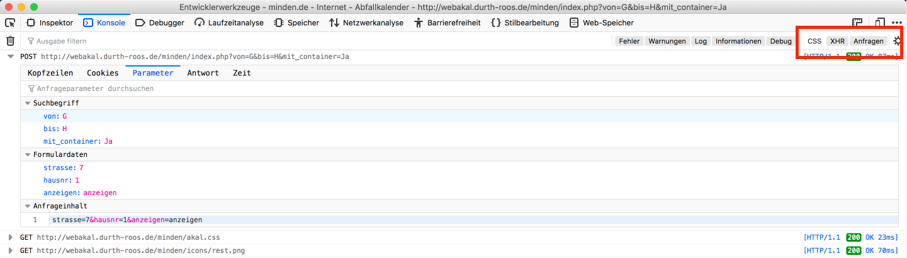

# Abfallkalender

Abfallkalender als iCal Feed ([Durth Roos Consulting GmbH](https://durth-roos.de/))

# Installation

```
git clone https://github.com/danielsundermeier/abfallkalender.git
cd abfallaklender
mv config.example.php config.php
```

# Usage

Variablen in config.php setzen

[Abfallkalender Minden](http://webakal.durth-roos.de/minden/index.php?von=G&bis=H&mit_container=Ja)

1. Enwicklerkonsole öffnen
2. Straße, Hausnummer eintragen & anzeigen klicken



3. https://deine-domain.de/abfallkalender in Kalender eintragen
